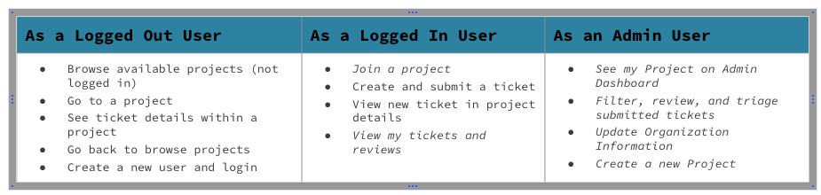
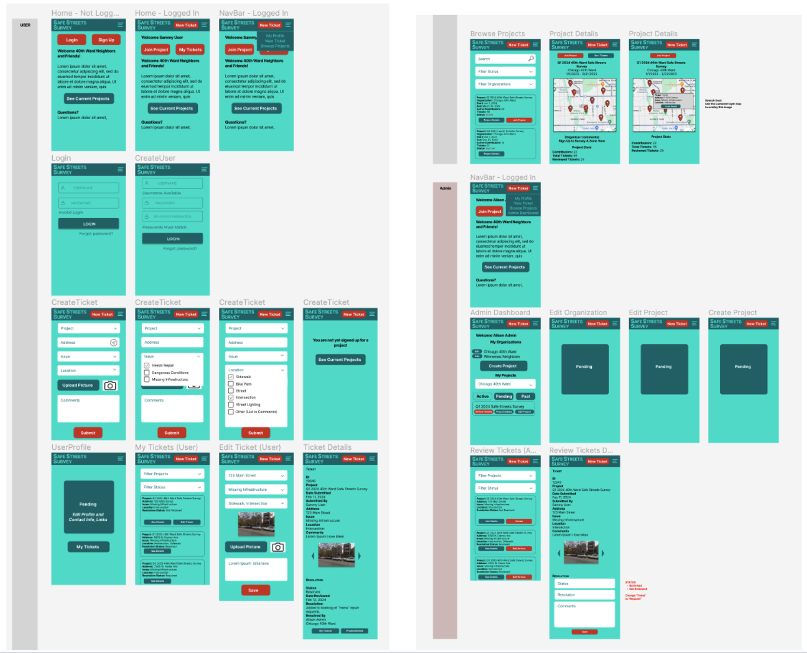
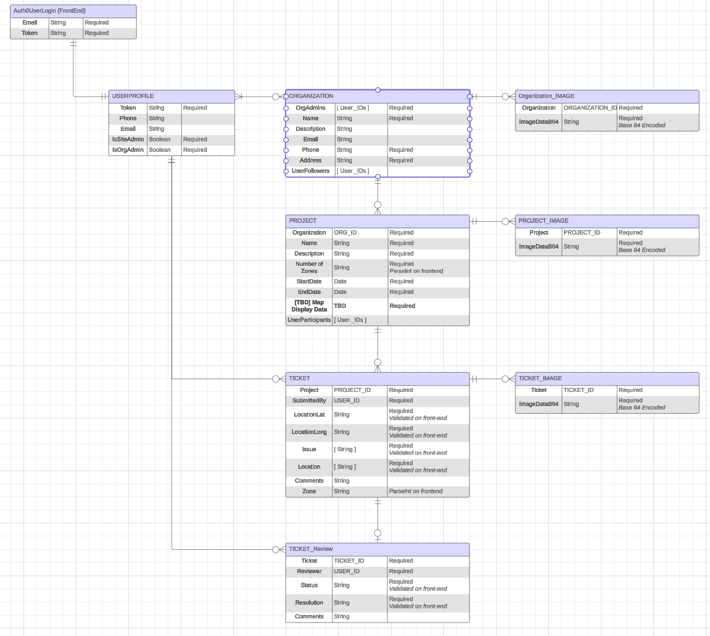
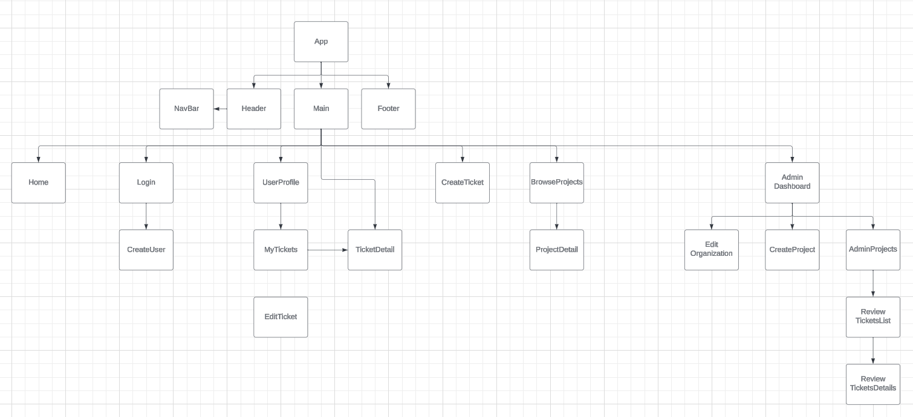
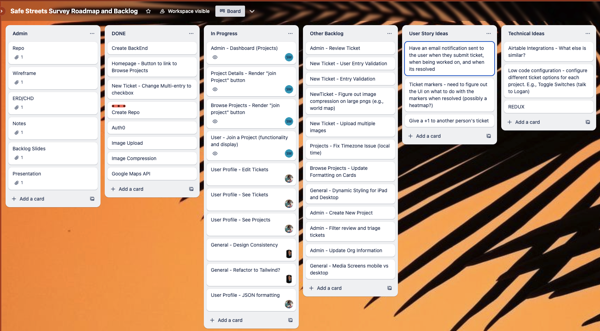
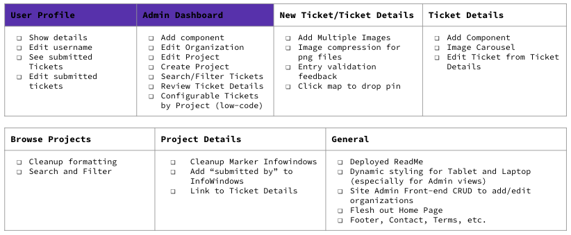
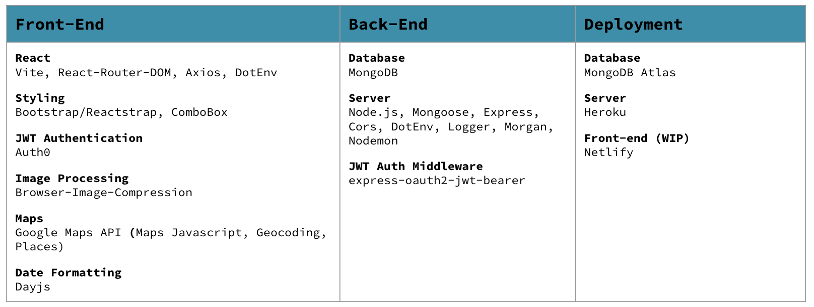

<a id="top"></a>
# Welcome to Safe Streets Survey

## Overview
**Safe Streets Survey** is a Mobile-friendly browser application to help local organizations crowdsource community feedback on local infrastructure issues.

**In partnership with the [Chicago 40th Ward](https://40thward.org/)**, the initial version of Safe Streets Survey will replace the current community tool to identify gaps in local pedestrian and cyclist infrastructure.

**The goal** is to and enable simple and detailed user feedback and streamline Ward triage of issues for bigger-picture resolution.

**Down the road**, we are looking to expand this into an open source initiative for any organization to create a location-based project to survey local infrastructure, including other governmental groups, park and community advisory boards, etc.

***Note** - This repo is for the front-end React application. The **repo for the backend** server and seed file can be found [here](https://github.com/sammymarks/SafeStreetsSurvey-Backend). **The deployed site** can be found [here](https://safe-streets-survey.netlify.app/).*


**Table of contents:**
1. [Functionality and User Stories](#functionality)
1. [Planning and Documentation](#documentation)
1. [Roadmap and Backlog](#roadmap)
1. [How to Get Involved](#get-involved)
1. [Acknowledgements](#acknowledgements)
1. [Installation and Tech Stack](#tech)


<!-- headings -->
<a id="functionality"></a>
## Functionality and User Stories
#### User Stories and Test Cases
V1 User Stories include the following. Additional user stories are on the roadmap.


#### Functionality Highlights for V1
- **Login via Auth0** 
    - Home > Login > Profile
    - Authenticated and encrypted login via Auth0, enables additional front-end functionality and access to encryped backend.
- **View my Profile (WIP)**
    - Nav > My Profile
    - Edit contact information, view and edit submitted tickets, view joined projects.
- **Browse  Projects** 
    - Home > Browse Projects || Nav > Browse Projects
    - See and filter all available projects. Link to see project details or join project
- **View Project Details**
    - Browse Projects > Project Details || My Tickets > Ticket Details > Project Details
    - Includes project description, project statistics, interactive map with existing tickets indicated by markers, links to ticket details via map markers. Link to join project. 
- **Submit a Ticket**
    - Home > New Ticket || Nav > New Ticket
- **Admin Functionality (WIP)**
    - Nav > Admin Dashboard
    - Edit existing/planned projects, view and review tickets


*[Return to Top](#top)*


<a id="documentation"></a>
## Planning and Documentation
#### Documentation Links

- [Wireframe and Prototypes (Figma)](https://www.figma.com/file/PgBKZJRd5Z9HuNlAycoV2D/SafeStreetsSurveyWireframe?type=design&node-id=28%3A662&mode=design&t=gddylUez4ROKhTLA-1)
- [Entity Relationship Diagram (LucidChart)](Lhttps://lucid.app/lucidchart/7d32749a-1702-47f7-885f-de0499a68c37/edit?beaconFlowId=F6D620418334B4B3&invitationId=inv_5c45c9eb-7b81-4756-88d0-ec7541658c05&page=0_0#)
- [React Component Hierarchy Diagram (LucidChart)](https://lucid.app/lucidchart/7d32749a-1702-47f7-885f-de0499a68c37/edit?beaconFlowId=F6D620418334B4B3&invitationId=inv_5c45c9eb-7b81-4756-88d0-ec7541658c05&page=ps0QL4_C7fW1#)
- [Initial 40th Ward User Requirements](https://docs.google.com/document/d/1gg-8tuoF4f95qgKYHpgesNDGQ1xtYn2gtIXYTkn-P9k/edit)
- [Ongoing Backlog and Plan (Trello)](https://trello.com/b/AqvfREGa/ga-capstone-safe-streets-survey)

#### Wireframe

#### Entity Relationship Diagram

#### Component Hierarchy Diagram

#### User Requirements and Planning Notes
- Survey Lifecycle and Outcomes
- Design Parameters
- Day in a Life user stories
- Functionality Assumptions (e.g., Ticket options)
- Scope and Release Planning
#### Backlog and Plan
As of December 15, 2023

*[Return to Top](#top)*

<a id="roadmap"></a>
## Roadmap and Backlog
#### Roadmap
Right now, Safe Streets Survey is focused on meeting the needs of a single organization (Chicago 40th Ward) for a single type of project (Quarterly Safe Streets Survey). Down the road, we want to explore adding more organizations and project types, and eventually have fully configurable ticket options
#### R2 Backlog
The next release will include enhacements to existing functionality and inclusion of User Profile and Admin Dashboard.



*[Return to Top](#top)*

<a id="get-involved"></a>
## How to Get Involved
Have an idea or want to get involved with access to the backlog? DM me on [LinkedIn](https://www.linkedin.com/in/sammy-marks/) or submit an issue in the repo.


*[Return to Top](#top)*

<a id="acknowledgements"></a>
## Acknowledgements
#### General Assembly
Thank you to the instructors for General Assembly's SEI0911 Software Engineering Immersive cohort. This would not have been possible without the months of instruction and hours of debugging and suggestions.
#### Chicago 40th Ward
Thank you to the Chicago 40th Ward (especially Alison!) for being champions of pedestrian and cyclist safety and for being so willing to collaborate.
#### Online Developer Community
- Contributors on StackOverflow, Medium, and elsewhere gave incredible insight on very specific questions
- [Leigh Halliday's Youtube Channel](https://www.youtube.com/@leighhalliday) has a wealth of incredible Google Maps API for React tutorials
#### Founding Contributors
[Darcy Struble](https://github.com/darcystruble), [Logan Krieger](https://github.com/logankrieger317), and [Billy Rogers](https://github.com/williamrogerschi) went from cohort-mates to founding collaborators and continue to push me and this project forward in new directions. Check them out!
#### No- and Low-Cost Deployment
Special thanks to the following companies that support no- and low-cost small-scale deployments critical for this project.
- Otka Auth0 (Authentication)
- Google Cloud (Maps, Geolocation)
- MongoDB Atlas (Cloud Database)
- Netlify (Front-end Deployment)
- Heroku (Backend Deployment)

*[Return to Top](#top)*


<a id="tech"></a>
## Installation and Tech Stack
### Packages and Third-Party


### Front-End
#### Initial Installation
>`npm install`\
>`npm install --legacy-peer-deps`\
>`npm run dev`

*Note - ComboBox runs on an earlier version of React, hence the need for legacy peer dependencies*

#### .env
Must start with "VITE_" to work with the Vite React app. Accessed with:
`import.meta.env.VITE_VARIABLE`

- Auth0 (see below)
    - VITE_AUTH0_DOMAIN --> Unique to this deployment
    - VITE_AUTH0_CLIENT_ID --> Unique to this deployment
- Database 
    - VITE_DB_BASE_URL --> Deployed or LocalHost
- Google Maps API (see below)
    - VITE_GOOGLE_MAPS_PLACE_API_KEY --> Based on your unique (chargeable) Google Cloud account.

#### Otka Auth0 API

1. In your Auth0 dashboard, create a new Single Page Application
1. Access and follow Quickstart instructions
1. Document your Domain and Client IDs as .env variables
1. In the Auth0 Application Dashboard, add LocalHost and/or Deployed URLs to:
    - Allowed Callback URLs
    - Allowed Logout URLs
    - Allowed Web Origins
1. main.jsx encloses App.jsx with the Auth0Provider component:
    ```
    import { Auth0Provider } from '@auth0/auth0-react'

    <Auth0Provider
        domain={import.meta.env.VITE_AUTH0_DOMAIN}
        clientId={import.meta.env.VITE_AUTH0_CLIENT_ID}
        authorizationParams={{
            redirect_uri: window.location.origin,
            audience: "http://localhost:3001/", //THIS IS FROM  THE BACKEND API SETUP, SEE BELOW=
            scope: "openid profile email"
        }}
    >
        <App />
    </Auth0Provider> 
    ```


1. The following hook/methods are used in Header.jsx, which houses the Login/Logout functionality:\
`const { user, isAuthenticated, isLoading, getAccessTokenSilently, loginWithRedirect, logout } = useAuth0();
`

#### Google Cloud API
1. Create a new Project in Google Cloud
1. Document your API Key in .env
1. Make sure the following APIs/Services are enabled for your project:
    1. Maps Javascript API
    1. Geocoding API
    1. Places API
1. Call the API with the following code in the relevant components:
    ```    //GOOGLE MAPS API
        const [ GMapsLibraries ] = useState(['places']);
        const { isLoaded } = useLoadScript({
            googleMapsApiKey : import.meta.env.VITE_GOOGLE_MAPS_PLACE_API_KEY,
            libraries: GMapsLibraries
        })
    ```
1. The following hooks/methods are used where applicable:
    1. General Loading\
`        import { useLoadScript } from '@react-google-maps/api`    
    1. Maps and Markers\
`        import { GoogleMap, MarkerF, InfoWindowF } from '@react-google-maps/api`    
    1. Geocoding\
`    import {getGeocode, getLatLng} from "use-places-autocomplete"`
    1. Places Autocomplete\
`    import usePlacesAutocomplete, {getGeocode, getLatLng} from "use-places-autocomplete"`

### Back-End ([Link to Repo](https://github.com/sammymarks/SafeStreetsSurvey-Backend))
#### Initial Installation
>`npm install`\
>`npm run dev`

#### .env
- Port 
    - PORT
    - Defaults to localhost:3001
- Database URL
    - DB_URI

#### Auth0
1. In your Auth0 dashboard, create a new custom API
    1. Your "identifier" is a hard-coded string (e.g., used in "audience" above in the front-end)
    1. You will need to pick a Signing algorithm. This instance use RS256
1. In server.js...
    1. import methods/hooks\
        `const { auth } = require('express-oauth2-jwt-bearer')`
    1. create authentication middleware
        ```
            const jwtCheck = auth({
                audience: 'http://localhost:3001/',
                issuerBaseURL: 'https://dev-gep4yvt6w6o0kdbq.us.auth0.com/',
                tokenSigningAlg: 'RS256'
            })
        ```
    1. place middleware in desired controllers, e.g.,\
    `app.post("/users/auth/check-user", jwtCheck, userController.getOrCreateByAuth0ID)
`
1. The following must be passed in the header of any API call requiring backend authentication. Any API calls (e.g., get, post) can be used.
    ```
        const sampleAPICall = async () => {
            const token = await getAccessTokenSilently()
            const response = await axios.post(`${url}`, {
                //body
            }, {
                headers: {
                    authorization: `Bearer ${token}`,
                    auth0sub: user.sub,
                }
            })
        }

        //'user' is the Auth0 user authenticated on the front end. The API call is invalid without the logged in user. See above.
    ```

*[Return to Top](#top)*