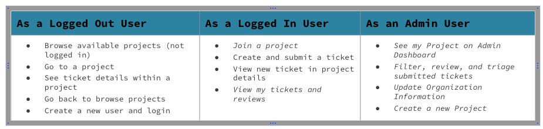
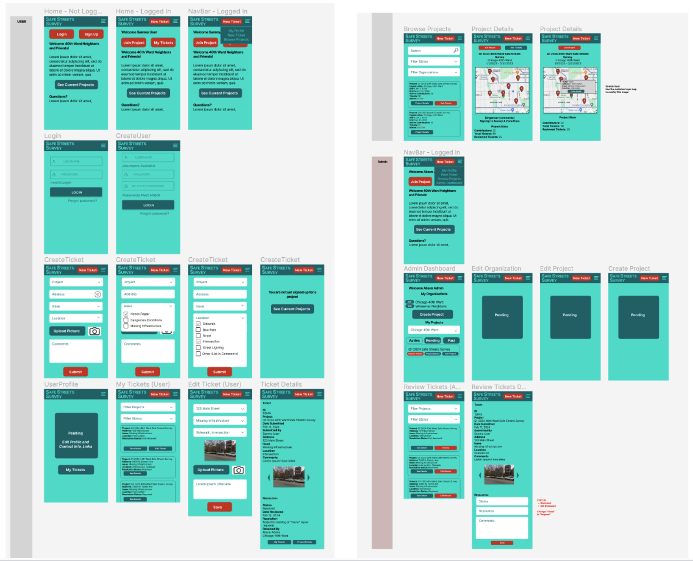
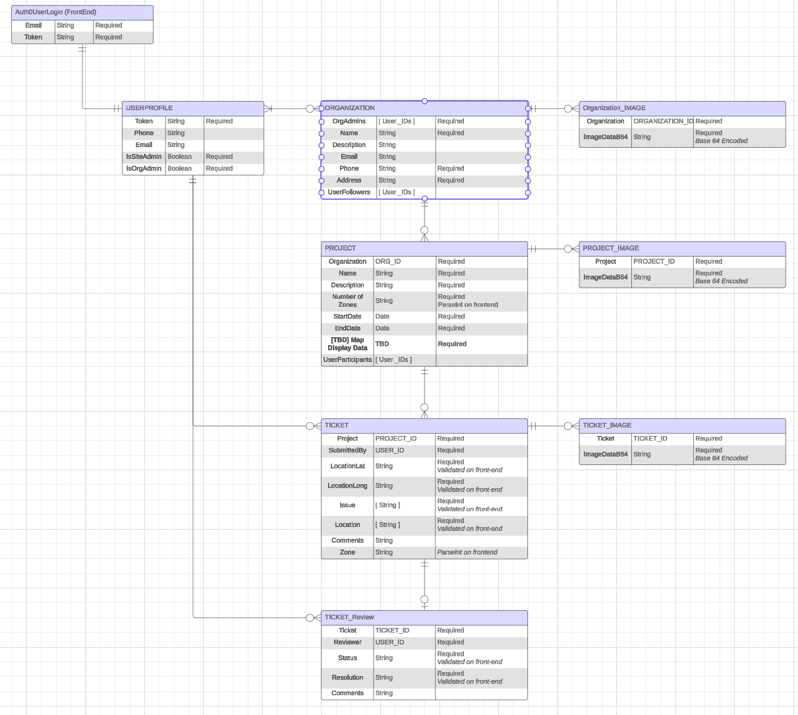
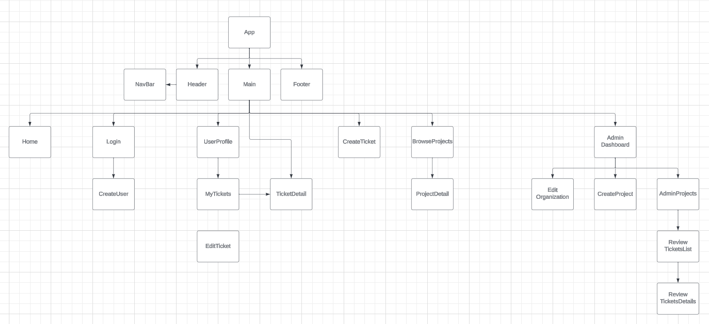

# Welcome to Safe Streets Survey

## Overview
**Safe Streets Survey** is a Mobile-friendly browser application to help local organizations crowdsource community feedback on local infrastructure issues.

**In partnership with the [Chicago 40th Ward](https://40thward.org/)**, the initial version of Safe Streets Survey will replace the current community tool to identify gaps in local pedestrian and cyclist infrastructure.

**The goal** is to and enable simple and detailed user feedback and streamline Ward triage of issues for bigger-picture resolution.

**Down the road**, we are looking to expand this into an open source initiative for any organization to create a location-based project to survey local infrastructure, including other governmental groups, park and community advisory boards, etc.

***Note** - This repo is for the front-end React application. The **repo for the backend** server and seed file can be found [here](https://github.com/sammymarks/SafeStreetsSurvey-Backend). **The deployed site** can be found [here](https://safe-streets-survey.netlify.app/).*

**Table of contents:**
1. [Functionality and User Stories](#functionality)
1. [Planning and Documentation](#documentation)
1. [Roadmap and Backlog](#roadmap)
1. [How to Get Involved](#get-involved)
1. [Acknowledgements](#acknowledgements)
1. [Installation and Tech Stack](#tech)

<!-- headings -->

## Functionality and User Stories
#### User Stories and Test Cases
V1 User Stories include the following. Additional user stories are on the roadmap.

#### Functionality Highlights for V1
- **Login via Auth0** 
    - Home > Login > Profile
    - Authenticated and encrypted login via Auth0, enables additional front-end functionality and access to encryped backend.
- **View my Profile (WIP)**
    - Nav > My Profile
    - Edit contact information, view and edit submitted tickets, view joined projects.
- **Browse  Projects** 
    - Home > Browse Projects || Nav > Browse Projects
    - See and filter all available projects. Link to see project details or join project
- **View Project Details**
    - Browse Projects > Project Details || My Tickets > Ticket Details > Project Details
    - Includes project description, project statistics, interactive map with existing tickets indicated by markers, links to ticket details via map markers. Link to join project. 
- **Submit a Ticket**
    - Home > New Ticket || Nav > New Ticket
- **Admin Functionality (WIP)**
    - Nav > Admin Dashboard
    - Edit existing/planned projects, view and review tickets

*[Return to Top](#top)*

## Planning and Documentation
#### Documentation Links

- [Wireframe and Prototypes (Figma)](https://www.figma.com/file/PgBKZJRd5Z9HuNlAycoV2D/SafeStreetsSurveyWireframe?type=design&node-id=28%3A662&mode=design&t=gddylUez4ROKhTLA-1)
- [Entity Relationship Diagram (LucidChart)](Lhttps://lucid.app/lucidchart/7d32749a-1702-47f7-885f-de0499a68c37/edit?beaconFlowId=F6D620418334B4B3&invitationId=inv_5c45c9eb-7b81-4756-88d0-ec7541658c05&page=0_0#)
- [React Component Hierarchy Diagram (LucidChart)](https://lucid.app/lucidchart/7d32749a-1702-47f7-885f-de0499a68c37/edit?beaconFlowId=F6D620418334B4B3&invitationId=inv_5c45c9eb-7b81-4756-88d0-ec7541658c05&page=ps0QL4_C7fW1#)
- [Initial 40th Ward User Requirements](https://docs.google.com/document/d/1gg-8tuoF4f95qgKYHpgesNDGQ1xtYn2gtIXYTkn-P9k/edit)

#### Wireframe

#### Entity Relationship Diagram

#### Component Hierarchy Diagram

#### User Requirements and Planning Notes
- Survey Lifecycle and Outcomes
- Design Parameters
- Day in a Life user stories
- Functionality Assumptions (e.g., Ticket options)
- Scope and Release Planning

*[Return to Top](#top)*

## Roadmap
#### User Stories
Content
#### Functionality Flows
Content

*[Return to Top](#top)*

## How to Get Involved
#### User Stories
Content
#### Functionality Flows
Content

*[Return to Top](#top)*

## Acknowledgements
#### User Stories
Content
#### Functionality Flows
Content

*[Return to Top](#top)*

## Installation and Tech Stack

#### User Stories
Content
#### Functionality Flows
Content

*[Return to Top](#top)*